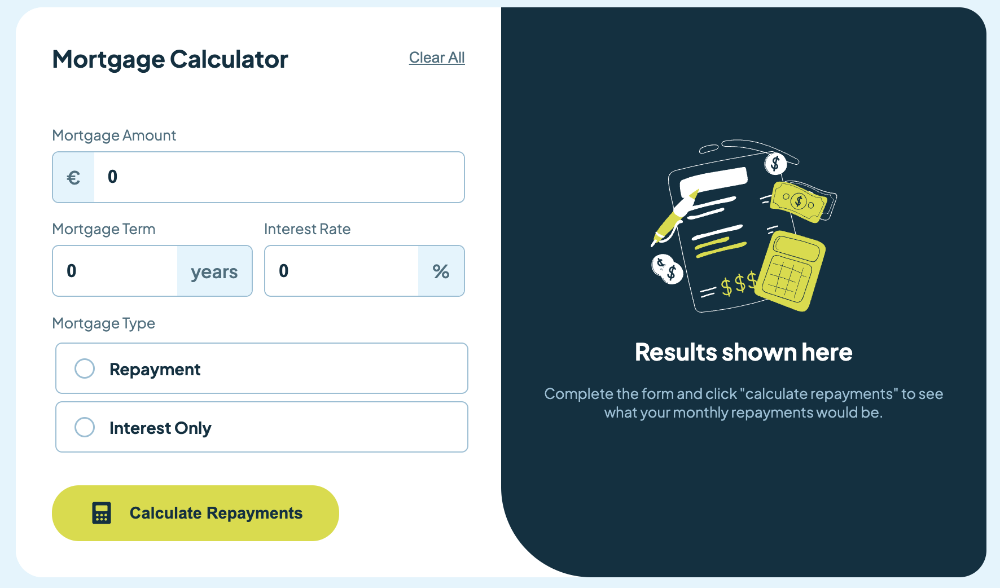
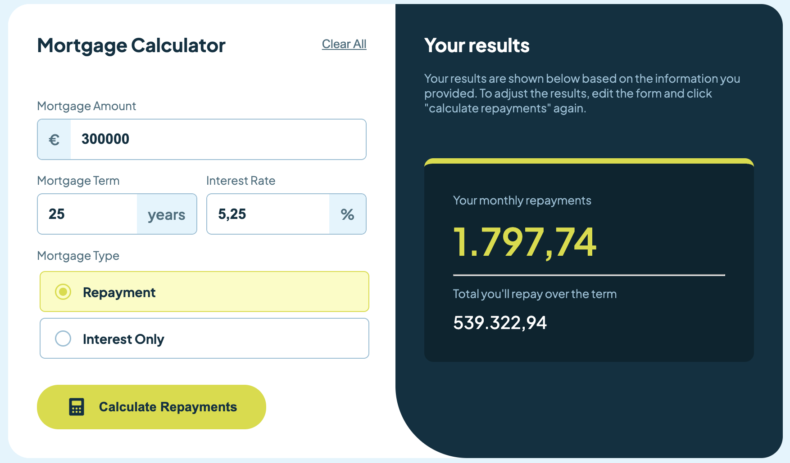

# Mortgage Repayment Calculator

## Overview

This project is my solution to the **Mortgage Repayment Calculator Challenge** by [Frontend Mentor](https://www.frontendmentor.io).

The goal of the challenge was to build a responsive Mortgage Repayment Calculator that closely matches the provided design - including a clean layout and component hierarchy, hover / active states and form validation.

## Features

- Mortgage repayment calculation with two options:
  - **Repayment** – based on the standard annuity formula for mortgage loans
  - **Interest-only** – only the interest is paid during the term, resulting in a residual debt at the end
- Form validation with error messages when required fields are not filled in
- Responsive layout for desktop, tablet and smartphone
- Hover and active states for improved user interaction
- Clean component-based architecture

## Screenshots

## Getting Started

To run the project locally:

1. Clone the repository
2. Run `npm install`
3. Run `npm start`
4. Open http://localhost:4200/

## Links

- Challenge: https://www.frontendmentor.io/challenges/mortgage-repayment-calculator-Galx1LXK73

## Built With

- Angular
- HTML5
- CSS3
- Responsive Design (Flexbox, Grid)

For this project, I deliberately used plain CSS instead of a CSS framework or preprocessor. The focus was on implementing layouts, media queries, and component styling from scratch in order to strengthen my understanding of core CSS concepts.

## Architecture

The project's focus was on understanding and strengthening Angular fundamentals such as:

- Component-based architecture
- Standalone components
- Data binding (property and event binding)
- Form handling and validation using Angular's template-driven forms
- Separation of logic and template
